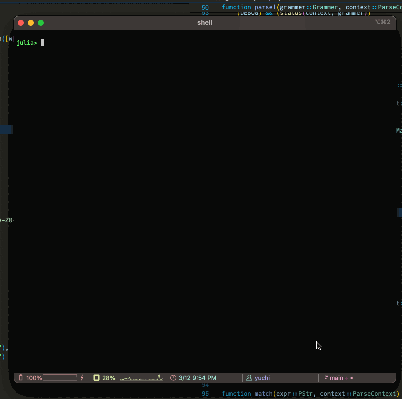

# TinyPeg

[](https://github.com/abap34/TinyPeg.jl/actions/workflows/CI.yml?query=branch%3Amain)

Toy-level PEG parser generator implemented in Julia.


# Design

Supports below features:

- [x] `PStr` (string)
- [x] `PAny` (any character)
- [x] `PRegex` (regex)
- [x] `PNot` (negative lookahead)
- [x] `PSeq` (sequence)
- [x] `PChoice` (ordered choice)
- [x] `PMany` (zero or more)


# Example

## Parse Date

```julia
using Dates
using TinyPeg

pint(x) = parse(Int, x)

date = Grammer(
    PSeq(
        PRegex(r"\d{4}"),
        PStr("/"),
        PRegex(r"\d{2}"),
        PStr("/"),
        PRegex(r"\d{2}")
    ),
    w -> Date(
            pint(w[1]), 
            pint(w[2][2][1]), 
            pint(w[2][2][2][2])
        )
)

parse!(date, "2024/03/04")
```

## Mini Programming Language

To define syntax, refer to `example/minilang.jl`.

```julia
src = "a=1.5;b=2;c=3;d=a+b*c/3;println(d)"

ast = parse!(source, src) 
# let
#     a = 1.5
#     b = 2
#     c = 3
#     d = a + (b * c) / 3
#     println(d)
# end


eval(ast) 
# 3.5
```

Under `setdebug!(true)`, it will print debug information.

